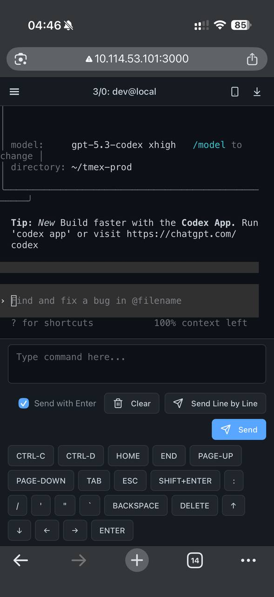
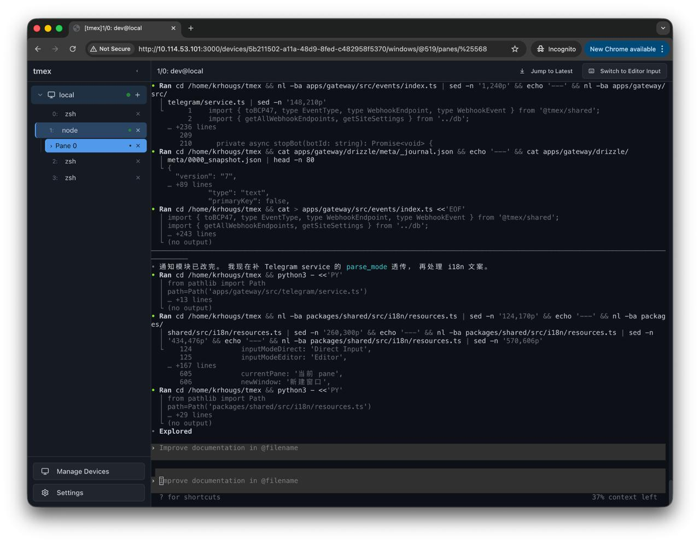

# tmex

针对 CJK 输入和移动端操作专项优化的 Vibe Coding 监工神器 ~~，你的睡眠质量毁灭者~~。

A Vibe Coding supervisor optimized for CJK input and mobile operation ~~, and a destroyer of your sleep quality~~.

## 特性 / Features

- ✏️ **CJK 输入优化** — 组合态输入保护，拼音/假名候选不会被拆开发送
- ✏️ **CJK Input Optimization** — Composition-aware input protection, prevents incomplete IME candidates from being sent
- 🔔 **Telegram Bot 通知** — Agent 需要交互时主动推送，支持多 Bot 和 chat 授权管理
- 🔔 **Telegram Bot Notifications** — Proactive push when agents need interaction, with multi-bot and chat authorization management
- 📱 **移动端交互优化** — 编辑器模式支持整段/逐行发送，触屏场景下也能舒服地操作终端
- 📱 **Mobile Interaction** — Editor mode with paragraph/line-by-line sending, comfortable terminal operation on touchscreens
- 🖥️ **tmux Control Mode + iTerm2** — 本地 iTerm2 无缝接管远程 tmux 会话，Web 和原生终端随时切换
- 🖥️ **tmux Control Mode + iTerm2** — Seamlessly take over remote tmux sessions from local iTerm2, switch between web and native terminal anytime
- 🌐 **本地 / SSH 多设备** — 同时管理本地和远程 SSH 设备，支持密码、私钥、SSH Agent、SSH Config 多种认证方式
- 🌐 **Local / SSH Multi-device** — Manage local and remote SSH devices simultaneously, supports password, private key, SSH Agent, and SSH Config authentication
- 🌍 **i18n 多语言支持** — 前后端完整国际化支持，目前提供简体中文和英文两种语言
- 🌍 **i18n Multilingual** — Full internationalization across frontend and backend, currently available in Simplified Chinese and English
- 🤖 **95% Vibe-coded** — 95% 代码由 AI 生成，经过人工审阅把关代码质量
- 🤖 **95% Vibe-coded** — 95% of the code is AI-generated, human-reviewed for code quality

## 健康免责 / Health Disclaimer

本项目不对因使用本工具导致的睡眠障碍、作息紊乱及其他健康问题承担任何责任。Coding Agent 凌晨三点喊你 review 不是我们的锅。

We are not responsible for any sleep deprivation, disrupted schedules, or other health issues caused by using this tool. It's not our fault if your Coding Agent wakes you up at 3 AM for a review.

<p align="center">
  &nbsp;&nbsp;
  
</p>

## 部署 / Deployment

> 面向小白的一键安装方案还在开发中，目前需要先安装 [Bun](https://bun.sh)。
>
> A beginner-friendly one-click installer is in progress. For now, [Bun](https://bun.sh) is required.

```bash
# 快速启动（自动安装依赖、生成配置、启动服务）
# Quick start (auto-installs deps, generates config, starts services)
./scripts/quick-start.sh

# 或使用开发模式启动 / Or start in dev mode
./scripts/start-dev.sh

# 或使用开发监工模式（自动重启服务 + 管理 ssh-agent）
# Or use dev supervisor mode (auto-restart services + managed ssh-agent lifecycle)
./scripts/dev-supervisor.sh
```

## 安全 / Security

> ⚠️ **本项目不包含用户鉴权机制，仅适用于受控内网环境。请勿将服务直接暴露在公网上。**
> 如需外网访问，建议通过 [Cloudflare Access](https://www.cloudflare.com/zero-trust/products/access/)、Tailscale 等零信任工具保护。
>
> ⚠️ **This project has no built-in authentication and is intended for controlled intranet use only. Do not expose it directly to the public internet.**
> For external access, use zero-trust tools such as [Cloudflare Access](https://www.cloudflare.com/zero-trust/products/access/) or Tailscale.

- 敏感数据（密码、私钥）使用 AES-256-GCM 加密存储 / Sensitive data (passwords, private keys) stored with AES-256-GCM encryption
- Webhook 使用 HMAC-SHA256 签名验证 / Webhooks verified with HMAC-SHA256 signatures

## 使用说明 / Usage

### 添加设备 / Adding Devices

1. 点击「管理设备」→「添加设备」/ Click "Manage Devices" → "Add Device"
2. 选择设备类型 / Choose device type:
   - **本地设备 / Local**: 直接使用宿主机的 tmux / Uses the host machine's tmux directly
   - **SSH 设备 / SSH**: 通过 SSH 连接远程服务器 / Connects to remote servers via SSH
3. 配置认证方式 / Configure authentication:
   - **密码 / Password**: 直接输入 SSH 密码 / Enter SSH password directly
   - **私钥 / Private Key**: 粘贴私钥内容（支持加密私钥）/ Paste private key content (encrypted keys supported)
   - **SSH Agent**: 使用本地 ssh-agent（推荐）/ Use local ssh-agent (recommended)
   - **SSH Config**: 引用 `~/.ssh/config` 中的配置 / Reference configurations in `~/.ssh/config`

### 连接终端 / Connecting to a Terminal

1. 在侧边栏点击设备名称展开 / Click a device name in the sidebar to expand it
2. 点击「连接」按钮 / Click the "Connect" button
3. 在终端区域输入命令 / Type commands in the terminal area

### 移动端输入 / Mobile Input

- **直接输入模式**（默认）/ **Direct Input Mode** (default): 自动保护输入组合态，避免拼音候选被拆开发送 / Automatically protects composition state to prevent incomplete input from being sent
- **编辑器模式 / Editor Mode**: 点击输入框进入，适合长文本输入，支持整段发送或逐行发送 / Tap the input box to enter; ideal for longer text, supports sending by paragraph or line

### 系统设置 / System Settings

1. 侧边栏点击「设置」进入设置页 / Click "Settings" in the sidebar
2. 可配置站点名称、站点访问 URL、Bell 频控与 SSH 自动重连参数 / Configure site name, site URL, bell throttling, and SSH auto-reconnect parameters
3. 可管理多个 Telegram Bot，审批待授权 chat、测试消息、撤销授权 / Manage multiple Telegram bots: approve pending chats, send test messages, revoke authorization
4. 配置调整后可在设置页触发「重启 Gateway」/ Trigger "Restart Gateway" from the settings page after making changes

## 项目结构 / Project Structure

```
tmex/
├── apps/
│   ├── gateway/          # Bun.js 网关服务 / Bun.js gateway service
│   │   ├── src/
│   │   │   ├── api/      # REST API 路由 / REST API routes
│   │   │   ├── crypto/   # 加密/解密层 / Encryption layer
│   │   │   ├── db/       # SQLite 数据库 / SQLite database
│   │   │   ├── events/   # Webhook + Telegram
│   │   │   ├── tmux/     # tmux -CC 连接与解析 / tmux -CC connection & parser
│   │   │   └── ws/       # WebSocket 服务器 / WebSocket server
│   │   └── Dockerfile
│   └── fe/               # React 前端 / React frontend
│       ├── src/
│       │   ├── components/  # UI 组件 / UI components
│       │   ├── hooks/       # 自定义 Hooks / Custom hooks
│       │   ├── pages/       # 页面组件 / Page components
│       │   └── stores/      # Zustand 状态 / Zustand stores
│       └── Dockerfile
├── packages/
│   └── shared/           # 前后端共享类型 / Shared types
├── docs/                 # 技术文档 / Technical docs
├── scripts/              # 实用脚本 / Utility scripts
├── docker-compose.yml
└── biome.json
```

## 技术栈 / Tech Stack

| 层级 / Layer          | 技术 / Technologies                                                         |
| --------------------- | --------------------------------------------------------------------------- |
| **后端 / Backend**    | Bun.js, SQLite, ssh2, Web Crypto API, gramio (Telegram)                     |
| **前端 / Frontend**   | React 19, TypeScript, Vite, xterm.js, Tailwind CSS, TanStack Query, Zustand |
| **协议 / Protocol**   | tmux -CC (Control Mode), WebSocket                                          |
| **部署 / Deployment** | Docker Compose, Nginx                                                       |

## 开发 / Development

```bash
# 安装依赖 / Install dependencies
bun install

# 代码检查 / Lint
bun run lint

# 格式化 / Format
bun run format

# 运行测试 / Run tests
bun run test

# 健康检查 / Health check
chmod +x scripts/health-check.sh
./scripts/health-check.sh
```

## 环境变量 / Environment Variables

| 变量 / Variable    | 必需 / Required | 默认值 / Default        | 说明 / Description                                                         |
| ------------------ | --------------- | ----------------------- | -------------------------------------------------------------------------- |
| `TMEX_MASTER_KEY`  | 是 / Yes        | —                       | 加密主密钥（生产环境必需）/ Master encryption key (required in production) |
| `TMEX_BASE_URL`    | 否 / No         | `http://127.0.0.1:9883` | 站点访问 URL / Site access URL                                             |
| `TMEX_SITE_NAME`   | 否 / No         | `tmex`                  | 站点名称 / Site name                                                       |
| `GATEWAY_PORT`     | 否 / No         | `9663`                  | Gateway 服务端口 / Gateway service port                                    |
| `FE_PORT`          | 否 / No         | `9883`                  | 前端服务端口 / Frontend service port                                       |
| `DATABASE_URL`     | 否 / No         | `/tmp/tmex.db`          | SQLite 数据库路径 / SQLite database path                                   |
| `TMEX_GATEWAY_URL` | 否 / No         | `http://localhost:9663` | 前端代理 Gateway 地址 / Frontend proxy target for Gateway                  |
| `NODE_ENV`         | 否 / No         | `development`           | 环境模式 / Environment mode                                                |
| `GATEWAY_WAIT_TIMEOUT_SECONDS` | 否 / No | `30` | `dev-supervisor` 首次启动前端前等待 Gateway 就绪的超时时间（秒）/ Timeout (seconds) before first frontend start when waiting for gateway readiness in `dev-supervisor` |

## 文档 / Documentation

- [部署指南 / Deployment Guide](docs/2026021000-tmex-bootstrap/deployment.md)
- [架构文档 / Architecture](docs/2026021000-tmex-bootstrap/architecture.md)

## License

MIT
