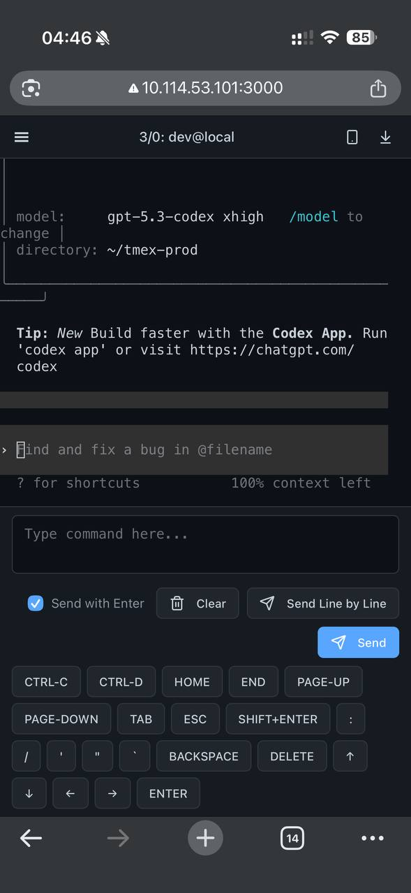
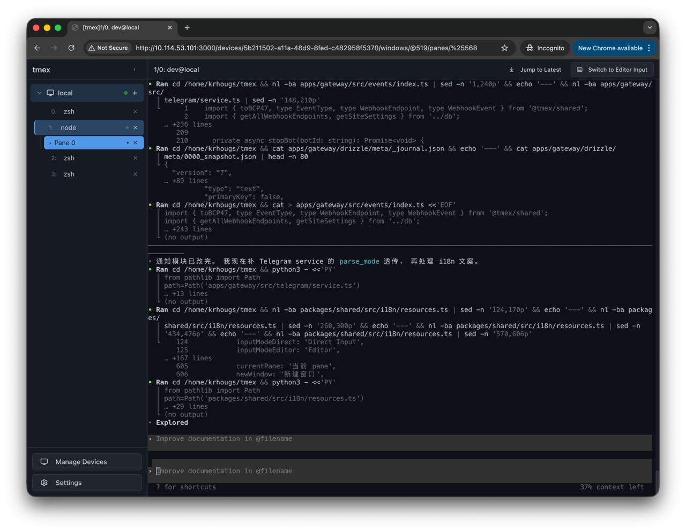

<p align="center">
  
</p>

<h1 align="center">tmex</h1>
针对 CJK 输入和移动端操作专项优化的 Vibe Coding 监工神器 ~~，你的睡眠质量毁灭者~~。

A Vibe Coding supervisor optimized for CJK input and mobile operation ~~, and a destroyer of your sleep quality~~.

```bash
# Quick Start
npx tmex-cli init
```

---

### **无缝兼容所有 Coding Agent CLI，交互通知开箱即用。零学习成本，有 tmux 就行。**

### **Works with every Coding Agent CLI, interaction notifications included. Zero learning curve — just tmux.**

## 特性 / Features

- ✏️ **CJK 输入优化** — 组合态输入保护，拼音/假名候选不会被拆开发送
- ✏️ **CJK Input Optimization** — Composition-aware input protection, prevents incomplete IME candidates from being sent
- 🔔 **Telegram Bot 通知** — Agent 需要交互时主动推送，支持多 Bot 和 chat 授权管理
- 🔔 **Telegram Bot Notifications** — Proactive push when agents need interaction, with multi-bot and chat authorization management
- 📱 **移动端交互优化** — 编辑器模式支持整段/逐行发送，触屏场景下也能舒服地操作终端
- 📱 **Mobile Interaction** — Editor mode with paragraph/line-by-line sending, comfortable terminal operation on touchscreens
- 🖥️ **tmux Control Mode + iTerm2** — 本地 iTerm2 无缝接管远程 tmux 会话，Web 和原生终端随时切换
- 🖥️ **tmux Control Mode + iTerm2** — Seamlessly take over remote tmux sessions from local iTerm2, switch between web and native terminal anytime
- 🌐 **本地 / SSH 多设备** — 同时管理本地和远程 SSH 设备，支持密码、私钥、SSH Agent、SSH Config 多种认证方式
- 🌐 **Local / SSH Multi-device** — Manage local and remote SSH devices simultaneously, supports password, private key, SSH Agent, and SSH Config authentication
- 🌍 **i18n 多语言支持** — 前后端完整国际化支持，目前提供简体中文和英文两种语言
- 🌍 **i18n Multilingual** — Full internationalization across frontend and backend, currently available in Simplified Chinese and English
- 🤖 **95% Vibe-coded** — 95% 代码由 AI 生成，经过人工审阅把关代码质量
- 🤖 **95% Vibe-coded** — 95% of the code is AI-generated, human-reviewed for code quality

## 健康免责 / Health Disclaimer

本项目不对因使用本工具导致的睡眠障碍、作息紊乱及其他健康问题承担任何责任。Coding Agent 凌晨三点喊你 review 不是我们的锅。

We are not responsible for any sleep deprivation, disrupted schedules, or other health issues caused by using this tool. It's not our fault if your Coding Agent wakes you up at 3 AM for a review.

<p align="center">
  &nbsp;&nbsp;
  
</p>

## 部署 / Deployment

> 安装与升级依赖 [Bun](https://bun.sh)（`doctor` 会检查 Bun 版本）。
>
> Installation and upgrade require [Bun](https://bun.sh) (`doctor` checks Bun version).

```bash
# 交互式初始化（生成 app.env + 安装用户级服务）
# Interactive setup (generates app.env + installs user service)
npx tmex-cli init

# 无交互初始化（CI/自动化）
# Non-interactive setup (CI/automation)
npx tmex-cli init --no-interactive \
  --install-dir ~/.local/share/tmex \
  --host 127.0.0.1 \
  --port 9883 \
  --db-path ~/.local/share/tmex/data/tmex.db \
  --autostart true

# 环境诊断（一次性输出依赖与配置问题）
# Environment diagnosis (one-shot dependency/config report)
npx tmex-cli doctor

# 升级到最新版（默认 latest，可用 --version 指定）
# Upgrade to latest (default latest, use --version to pin)
npx tmex-cli upgrade

# 卸载（交互确认，可加 --yes / --purge 自动化）
# Uninstall (interactive by default, use --yes / --purge for automation)
npx tmex-cli uninstall
```

## 安全 / Security

> ⚠️ **本项目不包含用户鉴权机制，仅适用于受控内网环境。请勿将服务直接暴露在公网上。**
> 如需外网访问，建议通过 [Cloudflare Access](https://www.cloudflare.com/zero-trust/products/access/)、Tailscale 等零信任工具保护。
>
> ⚠️ **This project has no built-in authentication and is intended for controlled intranet use only. Do not expose it directly to the public internet.**
> For external access, use zero-trust tools such as [Cloudflare Access](https://www.cloudflare.com/zero-trust/products/access/) or Tailscale.

- 敏感数据（密码、私钥）使用 AES-256-GCM 加密存储 / Sensitive data (passwords, private keys) stored with AES-256-GCM encryption
- Webhook 使用 HMAC-SHA256 签名验证 / Webhooks verified with HMAC-SHA256 signatures

## FAQ

**Q: 部分 Agent 在需要回答问题等交互场景下没有触发通知？**

在项目的 `AGENTS.md`（或对应的 system prompt）中指示模型：在需要用户交互时（包括提问、任务完成、等待确认等）显式输出 `\a`（BEL 控制字符）。tmex 通过捕获 bell 事件来触发通知推送。

**Q: Some agents don't trigger notifications when they need user interaction (e.g. asking a question)?**

Add an instruction to your `AGENTS.md` (or system prompt) telling the model to explicitly output `\a` (the BEL control character) whenever user interaction is needed — including questions, task completion, or awaiting confirmation. tmex captures bell events to trigger push notifications.

---

**Q: 网络中断或其他原因导致模型中断输出，为什么没有通知？**

这属于 Coding Agent 自身的职责范围。目前大多数 Coding Agent（无论 CLI 还是 Web）在输出意外中断时都不会发出提醒，tmex 无法感知 Agent 内部的异常状态。

**Q: Why is there no notification when the model stops outputting due to network issues or other errors?**

This falls under the Coding Agent's own responsibility. Most Coding Agents today — both CLI and web — do not emit any alert when output is unexpectedly interrupted, so tmex has no way to detect the agent's internal failure state.

---

**Q: SSH 设备开了很多 pane 以后，为什么通知或输出捕获会异常？**

tmex 会为每个 pane 建立独立的远端读取 channel。OpenSSH 默认 `MaxSessions=10`，pane 数较多时可能触顶，导致部分 pane 的捕获失败。请在 SSH 目标机的 `sshd_config` 中将 `MaxSessions` 调整到至少 `pane 数 + 3`，然后重启 sshd。

**Q: Why do SSH devices with many panes sometimes miss notifications or pane output?**

tmex opens one remote reader channel per pane. OpenSSH defaults `MaxSessions` to `10`, so a larger pane count can exhaust the limit and break capture on some panes. Increase `MaxSessions` in the target host's `sshd_config` to at least `pane count + 3`, then restart sshd.

**Q: 为什么 tmex 默认没有把 OSC passthrough 直接打开？**

tmex 自己解析 Coding Agent 通知不依赖 `allow-passthrough`。默认关闭 passthrough 是为了避免 pane 内程序把终端私有控制序列直接透传到宿主终端，扩大终端逃逸面。如果你明确需要让 iTerm2 等宿主终端也收到 OSC，请手动设置环境变量 `TMEX_TMUX_ALLOW_PASSTHROUGH=true`。

**Q: Why doesn’t tmex enable OSC passthrough by default?**

tmex does not need `allow-passthrough` to parse Coding Agent notifications itself. Passthrough is disabled by default to avoid letting pane processes forward private terminal control sequences directly to the host terminal and expanding the terminal-escape attack surface. If you explicitly want host terminals like iTerm2 to receive OSC sequences too, set `TMEX_TMUX_ALLOW_PASSTHROUGH=true`.

## 使用说明 / Usage

### 添加设备 / Adding Devices

1. 点击「管理设备」→「添加设备」/ Click "Manage Devices" → "Add Device"
2. 选择设备类型 / Choose device type:
   - **本地设备 / Local**: 直接使用宿主机的 tmux / Uses the host machine's tmux directly
   - **SSH 设备 / SSH**: 通过 SSH 连接远程服务器 / Connects to remote servers via SSH
3. 配置认证方式 / Configure authentication:
   - **密码 / Password**: 直接输入 SSH 密码 / Enter SSH password directly
   - **私钥 / Private Key**: 粘贴私钥内容（支持加密私钥）/ Paste private key content (encrypted keys supported)
   - **SSH Agent**: 使用本地 ssh-agent（推荐）/ Use local ssh-agent (recommended)
   - **SSH Config**: 引用 `~/.ssh/config` 中的配置 / Reference configurations in `~/.ssh/config`

### 连接终端 / Connecting to a Terminal

1. 在侧边栏点击设备名称展开 / Click a device name in the sidebar to expand it
2. 点击「连接」按钮 / Click the "Connect" button
3. 在终端区域输入命令 / Type commands in the terminal area

### 移动端输入 / Mobile Input

- **直接输入模式**（默认）/ **Direct Input Mode** (default): 自动保护输入组合态，避免拼音候选被拆开发送 / Automatically protects composition state to prevent incomplete input from being sent
- **编辑器模式 / Editor Mode**: 点击输入框进入，适合长文本输入，支持整段发送或逐行发送 / Tap the input box to enter; ideal for longer text, supports sending by paragraph or line

### 系统设置 / System Settings

1. 侧边栏点击「设置」进入设置页 / Click "Settings" in the sidebar
2. 可配置站点名称、站点访问 URL、Bell 频控与 SSH 自动重连参数 / Configure site name, site URL, bell throttling, and SSH auto-reconnect parameters
3. 可管理多个 Telegram Bot，审批待授权 chat、测试消息、撤销授权 / Manage multiple Telegram bots: approve pending chats, send test messages, revoke authorization
4. 配置调整后可在设置页触发「重启 Gateway」/ Trigger "Restart Gateway" from the settings page after making changes

## 项目结构 / Project Structure

```
tmex/
├── apps/
│   ├── gateway/          # Bun.js 网关服务 / Bun.js gateway service
│   │   ├── src/
│   │   │   ├── api/      # REST API 路由 / REST API routes
│   │   │   ├── crypto/   # 加密/解密层 / Encryption layer
│   │   │   ├── db/       # SQLite 数据库 / SQLite database
│   │   │   ├── events/   # Webhook + Telegram
│   │   │   ├── tmux/     # tmux 辅助能力 / tmux helpers
│   │   │   ├── tmux-client/ # external tmux CLI runtime / 外部 tmux CLI 运行时
│   │   │   └── ws/       # WebSocket 服务器 / WebSocket server
│   │   └── Dockerfile
│   └── fe/               # React 前端 / React frontend
│       ├── src/
│       │   ├── components/  # UI 组件 / UI components
│       │   ├── hooks/       # 自定义 Hooks / Custom hooks
│       │   ├── pages/       # 页面组件 / Page components
│       │   └── stores/      # Zustand 状态 / Zustand stores
│       └── Dockerfile
├── packages/
│   └── shared/           # 前后端共享类型 / Shared types
├── docs/                 # 技术文档 / Technical docs
├── scripts/              # 实用脚本 / Utility scripts
├── docker-compose.yml
└── biome.json
```

## 技术栈 / Tech Stack

| 层级 / Layer          | 技术 / Technologies                                                         |
| --------------------- | --------------------------------------------------------------------------- |
| **后端 / Backend**    | Bun.js, SQLite, ssh2, Web Crypto API, gramio (Telegram)                     |
| **前端 / Frontend**   | React 19, TypeScript, Vite, xterm.js, Tailwind CSS, TanStack Query, Zustand |
| **协议 / Protocol**   | external tmux CLI + WebSocket（legacy JSON + binary output；规划：Borsh 全二进制） |
| **部署 / Deployment** | Docker Compose, Nginx                                                       |

## 开发 / Development

```bash
# 安装依赖 / Install dependencies
bun install

# 代码检查 / Lint
bun run lint

# 格式化 / Format
bun run format

# 运行测试 / Run tests
bun run test

# 健康检查 / Health check
chmod +x scripts/health-check.sh
./scripts/health-check.sh
```

## 发版 / Publish

> 维护者指南，普通用户无需关注。
>
> Maintainers only.

完整发布说明见：

- [tmex-cli 发布流程](docs/release/2026041300-cli-release-process.md)

发布前必须在仓库根目录执行**全量重新编译**：

```bash
bun install
bun run build
bun run test:tmex
npm pack --dry-run --workspace tmex-cli
```

不要只执行 `bun run --filter tmex-cli build`，该命令不能保证共享 i18n 与前端静态资源都被重新生成。

## 环境变量 / Environment Variables

| 变量 / Variable                | 必需 / Required | 默认值 / Default        | 说明 / Description                                                                                                                                                     |
| ------------------------------ | --------------- | ----------------------- | ---------------------------------------------------------------------------------------------------------------------------------------------------------------------- |
| `TMEX_MASTER_KEY`              | 是 / Yes        | —                       | 加密主密钥（生产环境必需）/ Master encryption key (required in production)                                                                                             |
| `TMEX_BASE_URL`                | 否 / No         | `http://127.0.0.1:9883` | 站点访问 URL / Site access URL                                                                                                                                         |
| `TMEX_TMUX_ALLOW_PASSTHROUGH`  | 否 / No         | `false`                 | 是否在受管 tmux session 上启用 `allow-passthrough`。默认关闭，避免把 pane 内终端私有控制序列直接透传到宿主终端 / Whether to enable tmux `allow-passthrough` on managed sessions. Disabled by default to avoid forwarding private terminal control sequences from panes directly to the host terminal |
| `TMEX_SITE_NAME`               | 否 / No         | `tmex`                  | 站点名称 / Site name                                                                                                                                                   |
| `GATEWAY_PORT`                 | 否 / No         | `9663`                  | Gateway 服务端口 / Gateway service port                                                                                                                                |
| `FE_PORT`                      | 否 / No         | `9883`                  | 前端服务端口 / Frontend service port                                                                                                                                   |
| `DATABASE_URL`                 | 否 / No         | `/tmp/tmex.db`          | SQLite 数据库路径 / SQLite database path                                                                                                                               |
| `TMEX_GATEWAY_URL`             | 否 / No         | `http://localhost:9663` | 前端代理 Gateway 地址 / Frontend proxy target for Gateway                                                                                                              |
| `NODE_ENV`                     | 否 / No         | `development`           | 环境模式 / Environment mode                                                                                                                                            |
| `GATEWAY_WAIT_TIMEOUT_SECONDS` | 否 / No         | `30`                    | `dev-supervisor` 首次启动前端前等待 Gateway 就绪的超时时间（秒）/ Timeout (seconds) before first frontend start when waiting for gateway readiness in `dev-supervisor` |

## 文档 / Documentation

- [部署指南 / Deployment Guide](docs/2026021000-tmex-bootstrap/deployment.md)
- [架构文档 / Architecture](docs/2026021000-tmex-bootstrap/architecture.md)
- [发布流程 / Release Process](docs/release/2026041300-cli-release-process.md)

## License

MIT
